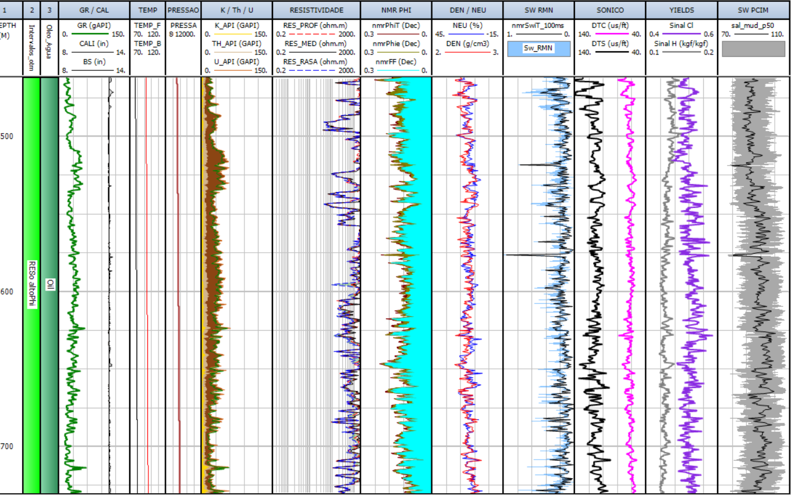

# Modelo Integrado Petrofísico-Composicional (PCIM)

#### Aluno: [Gabriel Freitas](https://github.com/gabrielnfreitas)
#### Orientador: [Felipe Borges](https://github.com/FelipeBorgesC)

---

Trabalho apresentado ao curso [BI MASTER](https://ica.puc-rio.ai/bi-master) como pré-requisito para conclusão de curso e obtenção de crédito na disciplina "Projetos de Sistemas Inteligentes de Apoio à Decisão".

---

### Resumo

<!-- trocar o texto abaixo pelo resumo do trabalho, em português -->

Lorem ipsum dolor 

### 1. Introdução

A petrofísica é o ramo de estudo das propriedades físicas e químicas das rochas e dos fluidos nelas contidos, segundo a definição presente na PetroWiki. A petrofísica desempenha um papel fundamental na indústria do petróleo, fornecendo informações valiosas sobre propriedades dos diversos tipos de rochas (reservatório, selantes, geradoras, etc). É uma disciplina que combina conhecimentos de geologia, física e engenharia para analisar e interpretar dados obtidos de amostras de rochas e fluidos. Através da petrofísica, é possível determinar propriedades como porosidade, permeabilidade, saturação de fluidos e resistividade elétrica das rochas, o que é essencial para a identificação e avaliação de reservatórios de óleo e gás. Essas informações são cruciais para o planejamento e execução de atividades de exploração, produção e desenvolvimento de campos petrolíferos.

Além de dados laboratoriais de rocha e de fluido, o principal insumo da petrofísica na avaliação de poços são os chamados "perfis de poços" (ou ainda perfis elétricos ou geofísicos). Tratam-se de registros contínuos de propriedades físicas das rochas ao longo de um poço, como resistividade elétrica, porosidade, densidade, velocidade das ondas sísmicas, entre outras, feitas através de ferramentas específicas que são corridas no poço durante ou após a perfuração. Cada ferramenta de perfilagem adquire diversas medidas que são processadas e utilizadas de acordo com a necessidade.

Combinando-se os dados experimentais de rocha e fluido com os perfis de poços, é possível construir os chamados "modelos petrofísicos". Tais modelos permitem o cálculo das propriedades petrofísicas das rochas honrando, segundo ponderações definidas pelo intérprete, o conjunto de dados fornecido. O cálculo dessas propriedades em escala de poço sempre apresenta algum tipo de aproximação ou incerteza, devido a fatores como:

1. Incertezas nas medidas e no processamento de dados dos perfis
2. Diferenças de resolução vertical e profundidade de investigação dos perfis
3. Diferenças de escala entre amostras de rocha/fluido e volume lido pelos perfis
4. Limitação da quantidade de parâmetros que podem ser medidos em relação ao conjunto total de parâmetros que determinam as propriedades

O problema tratado nesse trabalho diz respeito à identificação e a caracterização da matéria orgânica (MO) em intervalos de rochas geradoras de hidrocarbonetos, que é essencial para o entendimento do sistema petrolífero, como subsídio para entender os processos de geração e de acumulação do petróleo. Do ponto de vista experimental, a caracterização do conteúdo orgânico é feito através de ensaios típicos da Geoquímica Orgânica, como a pirólise Rock-Eval. No entanto, a fim de obter estimativas em escala de poço é necessário lançar mão de modelos utilizando perfis.

Nesse sentido, há alguns modelos petrofísicos consagrados, de cunho empírico, para a estimativa do carbono orgânico total (COT), como o chamado "método de Passey" ou o "Carbolog". Mais recentemente, com o advento das ferramentas de espectroscopia de raios gama induzido por nêutrons, conhecidos como perfis geoquímicos ou ainda perfil litogeoquímico (LGQ), é possível obter estimativas de COT valendo-se da resposta do carbono no espectro inelástico. No entanto, há poucos trabalhos na literatura que se proponham a estimar diretamente alguma propriedade que indique o tipo de querogênio, potencial de geração de óleo (S2) e/ou o índice de hidrogênio (IH).

O presente trabalho, tem como objetivo implementar computacionalmente uma metodologia recentemente desenvolvida pelo autor para a estimativa de S2 (potencial de óleo) em escala de poço a partir de perfis elétricos, dentre eles a medida de H e Cl oriundas do perfil litogeoquímico. A combinação da curva de S2 obtida com a curva correspondente de COT obtidos de forma independente, por outros métodos, fornece a curva de IH. 

### 2. Modelagem

O modelo petrofísico se traduz matematicamente em um conjunto de equações, algumas lineares e outras não-lineares, que envolvem múltiplas variáveis de entrada (sejam perfis medidos ou parâmetros determinados a partir de ensaios experimentais) e variáveis de saída que se quer determinar. Esse conjunto de equações é resolvido para cada passo de profundidade do poço, visto que as medidas dos perfis variam com a profundidade.

Após diversos testes e tentativas, optou-se por uma implementação que segue a seguinte filosofia geral. O modelo é tratado como um problema direto, em que são feitas simulações Monte-Carlo (MC) atribuindo distribuições para todos os parâmetros e perfis de entrada pertinentes. Para cada simulação, são calculadas saídas que devem obedecer a certos critérios de aceitabilidade: **(a)** conservação do conteúdo de cloro (y<sub>Cl</sub>); **(b)** propriedades calculadas de porosidade total ( &Phi;<sub>T</sub> ), densidade *bulk* (&rho;<sub>b</sub>) e perfil Sigma (&Sigma;<sub>f</sub>) devem ser iguais aos valores medidos dos respectivos perfis, se disponíveis, dentro de uma certo intervalo de confiança. Por exemplo, em uma dada profundidade a porosidade total medida pelo T2 RMN foi de 15 pu; admitindo um intervalo de confiança de $\pm$ 1pu, porosidades calculadas no intervalo 14 &ndash; 16 pu validam as entradas da simulação. Os dados das simulações que obedeceram aos critérios de aceitabilidade são armazenados ao longo do processo a avaliados *a posteriori* para obter os percentis de probabilidade, tipicamente P10, P50 e P90, para as propriedades avaliadas S2 e IH.

Em resumo, para cada profundidade em que o modelo é rodado, são rodadas *__N__* simulações MC onde cada variável de entrada é sorteada aleatoriamente segundo uma dada distribuição. Para cada simulação, diversas saídas são calculadas, como y<sub>Cl</sub>, &Phi<sub>T</sub>, &rho;<sub>b</sub>, &Sigma;<sub>f</sub>, S2 e IH. Se houver *__N<sub>v</sub>__ &le; N* simulações com resultados considerados válidos, então haverá *__N<sub>v</sub>__* valores válidos de S2 e IH, a partir do qual serão calculados respectivamente os percentis P10, P50 e P90 para aquela profundidade. Ao se aplicar o processo para todas as profundidades avaliadas, obtêm-se então curvas de probabilidade (na realidade são vetores, mas que normalmente são representados por linhas suaves em um gráfico cujo eixo vertical é a profundidade) para S2 e IH, que é o resultado final.

As profundidades usualmente são representadas em um passo de 0,1524m. Para um intervalo típico de 500m de 10.000 simulações MC, ao todo o modelo é rodado e avaliado $3,3 \times 10^7$ vezes. A fim de que o modelo fosse rodado em tempos compatíveis com a rotina de avaliação petrofísica, na ordem de poucos minutos, algumas medidas foram adotadas:

* Delimitação das faixas de valores para variáveis-chave, como o conteúdo de hidrogênio orgânico, de forma a evitar perda de tempo;
* Encerramento antecipado de uma simulação cuja conservação de y<sub>Cl</sub> seja violada;
* Uso de passos com menor resolução (0,4572m, 3 vezes o passo original), com suavização prévia dos valores;
* Sorteio de números aleatórios entre [0,1] para cada propriedade (respeitando a distribuição desejada) uma única vez para todas as profundidades;
* Paralelização do código utilizando a biblioteca _joblib_, em que cada profundidade é endereçada independentemente para cada processador disponível.

O código foi escrito no estilo de programação orientada a objeto, de forma a facilitar a aplicação em situações diversas e a inclusão de novas funcionalidades. Foram definidas as classes:

1. **elementos** &ndash; carrega propriedades físico-químicas dos elementos químicos.
2. **compostos** &ndash; incorpora a classe *elementos* e carrega propriedades dos compostos usualmente quantificados em análises de água de formação, contendo métodos de cálculo de massa molar e coeficiente mássico de absorção termal &mu;.
3. **petrofisica_agua** &ndash; incorpora a classe *compostos* e possui métodos para carregar resultados de água diretamente do banco de dados corporativo e de calcular o &mu; total da água e da parcela oriunda dos elementos outros que não NaCl e H<sub>2</sub>O.
4. **petrofisica_oleo** &ndash; incorpora a classe *elementos* e carrega propriedades dos compostos usualmente quantificados em análises PVT de petróleo. Possui métodos para (a) carregar resultados de liberação *flash* e liberação diferencial diretamente do banco de dados corporativo; (b) calcular a densidade do hidrocarboneto para uma dada condição de pressão (p) e temperatura (T), ajustando o conjunto de restulados experimentais carregados; (c) cálculo de composição química global; (d) cálculo das abosrções termais mássicas &mu;<sub>o</sub> e volumétricas &Sigma;<sub>o</sub> do hidrocarboneto.
5. **petrofisica_fluido_perf** &ndash; carrega propriedades experimentais de densidade em função de diferentes condições *p* e *T* para filtrados fluidos de perfuração típicos. Possui método para calcular densidade e &Sigma; do filtrado em função de *p* e *T*, além de método para calcular salinidade efetiva de fluidos sintéticos em função dos resultados da retorta e titulação de cloretos.
6. **modelo_petrofisica** &ndash; é a classe que recebe todos os dados de água, óleo e filtrado, além dos perfis e demais parâmetros de entrada, para a execução de diferentes modelos, dentre os quais o modelo objeto deste trabalho. Entre outros, possui métodos para carregar as distribuições de cada *input* e verificar se todos os *inputs* necessários para rodar o modelo estão presentes e com as devidas unidades. A execução de cada modelo apresenta parâmetros adicionais próprios, como por exemplo a profundidade do contato óleo/água, para definir as regras de mistura do filtrado com fluido da formação.

Dentro do método correspondente ao modelo na classe **modelo_petrofisica**, os resultados para cada profundidade são guardados em função do índice (profundidade), que ao final são devidamente concatenados e retornados como DataFrames. Cada propriedade de interesse é exportada em cinco colunas, correspondentes à média, desvio-padrão e aos percentis P10, P50 e P90.

A metodologia foi aplicada em um poço para o qual havia amostras de água e óleo analisados, assim como alguns resultados de geoquímica orgânica (pirólise Rock-Eval) e resultados experimentais de corte T2 RMN para amostras no reservatório de óleo. No entanto, não havia informações confiáveis disponíveis acerca da salinidade do fluido de perfuração, que foi um fluido de base sintética. Nesse caso, foi adotada a seguinte estratégia metodológica:

<ol type="A">
  <li> Calibração : simulação em reservatório com óleo, cuja saturação de água S<sub>w</sub> é estimada com razoável confiabilidade a partir do perfil de T2 RMN e a presença de matéria orgânica pode ser desprezada. A principal informação a ser obtida nessa etapa é a de salinidade do fluido de perfuração.</li>
  
  <li> Verificação : Utilização da salinidade da lama obtida na calibração em simulações em reservatórios portadores de água, com conteúdo também desprezível de MO. A ideia é verificar se as saturações obtidas estão petrofisicamente razoáveis. </li>
  
  <li> Aplicação: Aplicação efetiva do modelo nos intervalos com suspeita de presença de matéria orgânica para obtenção das curvas de COT, S2 e IH.</li>
</ol>

### 3. Resultados

O poço escolhido teve seis intervalos estudados. Para calibração, foi utilizado o intervalo _res_o_altophi_, portador de hidrocarboneto. Para verificação, foram utilizados os intervalos _res_w_altophi_ e _res_w_baixophi_, reservatórios portadores de água porém invadidos com filtrado base oleosa. Por fim, a aplicação abrangeu três intervalos de folhelhos (superior, intermediário e inferior), que são intercalados com os reservatórios de água. Em todos os casos, o critério de aceitabilidade dos resultados simulados foi de &Phi;<sub>T</sub> &plusmn; 1,5 pu e &rho;<sub>b</sub> &plusmn; 0,015 g/cc. 

A configuração do modelo para a etapa de calibração e simulação foram executadas pelo código abaixo, como exemplo. As estimativas de saturação mínima e máxima foram geradas pelo perfil T2 RMN, enquanto os valores de salinidade mínimo e máximo de água foram obtidos a partir dos dados expeirmentais carregados no objeto "agua". Foram testadas salinidades salinidades de 75 a 110 kppm equivalente de NaCl.

```python
df_calib=df_trat.loc[df_trat.Intervalo=='res_o_altophi']
calib_res=modelo_petrofisica(prof_idx=df_calib.index,oleo=oleo,lama=lama,agua=agua,unidade_T='C',unidade_p='psi')
calib_res.load_param('T',dist='uniforme',min=df_calib["T_min"],max=df_calib['T_max'])
calib_res.load_param('p',valor=df_calib["p"])
calib_res.load_param('phi',dist="uniforme",med=df_calib['PHIT'],delta=0.015)
calib_res.load_param('rhob',dist="uniforme",med=df_calib['RHOB'],delta=0.015)
calib_res.load_param('sal_w',dist="uniforme",min=salin_stats_agua['min'],max=salin_stats_agua['max'])
calib_res.load_param('Sw',dist='uniforme',min=df_calib["Sw_min"],max=df_calib["Sw_max"])
calib_res.load_param('rhomin',dist='normal',med=df_calib["RHOMIN"],desvpad=0.05)
calib_res.load_param('yH',dist='normal',med=df_calib["CHY"],desvpad=0.01)
calib_res.load_param('yCl',dist='normal',med=df_calib["CCHL"],desvpad=0.01)
calib_res.load_param('sal_mud',dist='uniforme',min=75,max=110)
calib_res.load_param('COTd',valor=0)
calib_res.load_param('K',dist='triangular',med=df_calib["K"],delta=0.001)
calib_res.load_param('FY2W',dist='normal',med=df_calib["FY2W"],desvpad=0.2)

calib_res.preparacao_modelo(calculo="salin_from_LGQ",MC_steps=20000,ferramenta='ECS')
resultados=calib_res.composicional_LGQ(contatoOA,n_jobs=-1)
```

<div align="left">

</div>
<br>

### 4. Conclusões

Lorem ipsum dolor sit amet, consectetur adipiscing elit. Proin pulvinar nisl vestibulum tortor fringilla, eget imperdiet neque condimentum. Proin vitae augue in nulla vehicula porttitor sit amet quis sapien. Nam rutrum mollis ligula, et semper justo maximus accumsan. Integer scelerisque egestas arcu, ac laoreet odio aliquet at. Sed sed bibendum dolor. Vestibulum commodo sodales erat, ut placerat nulla vulputate eu. In hac habitasse platea dictumst. Cras interdum bibendum sapien a vehicula.

Proin feugiat nulla sem. Phasellus consequat tellus a ex aliquet, quis convallis turpis blandit. Quisque auctor condimentum justo vitae pulvinar. Donec in dictum purus. Vivamus vitae aliquam ligula, at suscipit ipsum. Quisque in dolor auctor tortor facilisis maximus. Donec dapibus leo sed tincidunt aliquam.

---

Matrícula: 211.100.426

Pontifícia Universidade Católica do Rio de Janeiro

Curso de Pós Graduação *Business Intelligence Master*
